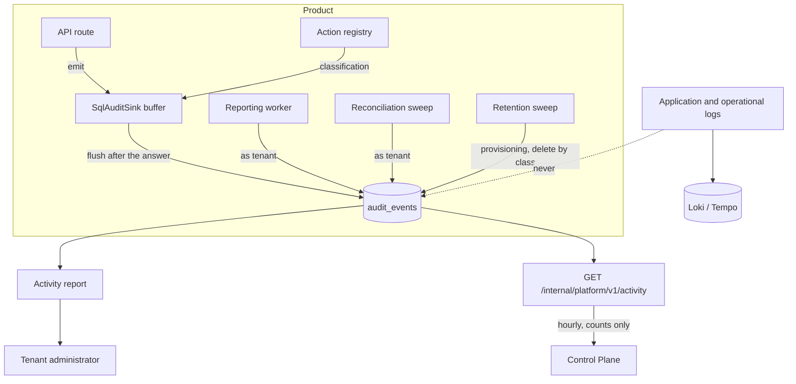
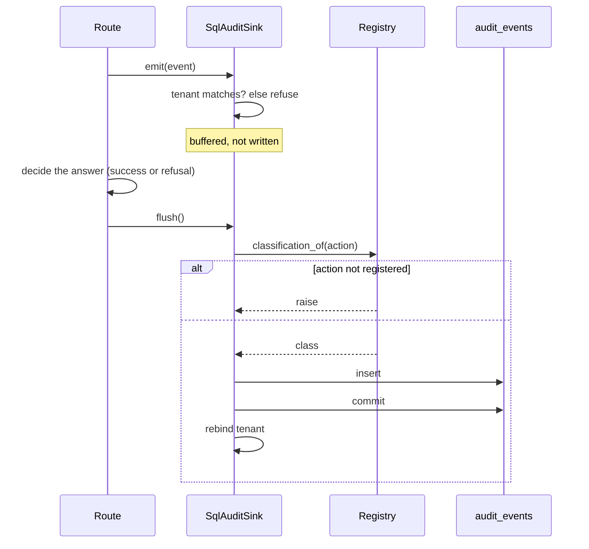
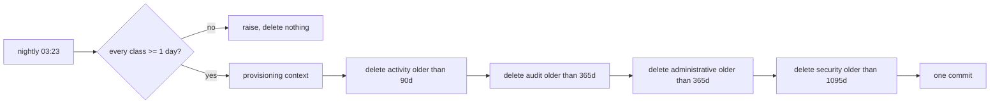
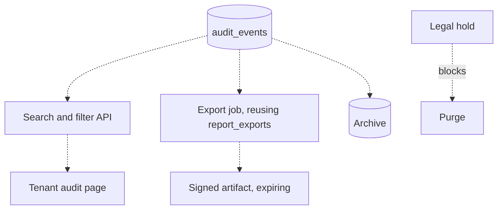

# SAG-F2 — Architecture

The prose description is `docs/AUDIT_ARCHITECTURE.md`. This carries the
diagrams and the one architectural question worth arguing.

## The question: is a separate event pipeline justified?

The original design sketched publisher → ingestion → validation → store. **The
ingestion tier was declined**, and the reasoning is the substance of this
document rather than a footnote.

Events are written inside the request's own transaction, on the tenant's own
session. That gives three properties for free that a queue would make into
problems:

| Property | Synchronous write | With an ingestion queue |
|----------|-------------------|-------------------------|
| Tenancy | Enforced by row-level security on the same session | The consumer must re-establish it, from data the producer sent |
| Atomicity | The record and the work commit together | A refusal can be returned and not recorded |
| Ordering | The transaction's clock | A delivery-order guarantee to design and defend |

The cost of the synchronous choice is latency on hot routes and a failed write
becoming a failed request. Neither is showing as of 2026-09-16.

**What would change the answer:** flush latency appearing in traces on the file
download path, or a volume at which the table's write rate matters. Both are
observable, and neither is observed. Building the queue first would be adding a
delivery guarantee to reason about in exchange for a problem nobody has.

## As built

The dashed edge is the design rule: **operational logs never enter the
compliance store.** Without that line the table becomes a log with a slower
query planner.

## Write path

Two details that cause bugs elsewhere and are handled once here: the buffer
exists so a mid-request write cannot leave the session in an unknown state, and
the rebind exists because the commit drops `app.tenant_id`, which is
transaction-local.

## Retention

The guard before the first delete is the safety property: a typo in one number
cannot delete the three that were right.

## Designed, not built

Everything dashed is design. `archival.md`, `legal-hold.md` and
`integration-contracts.md` carry the detail.

## Reuse, and what it buys

| Need | Existing mechanism reused |
|------|---------------------------|
| Export pipeline | `report_exports`: 202, background write, signed artifact, retirement |
| Approval for a destructive action | The AI foundation's action state machine and `may_decide` |
| Registry with import-time refusal | `koras_reporting`'s registries |
| Cross-tenant sweep | The provisioning declaration and the `_AS_TENANT` switch |
| Typed, declared filters | `koras_reporting.filters` — and its rule that there is no free-text filter |

Nothing in this feature needs a new framework. That is the point of the
architecture rather than an accident of it.
