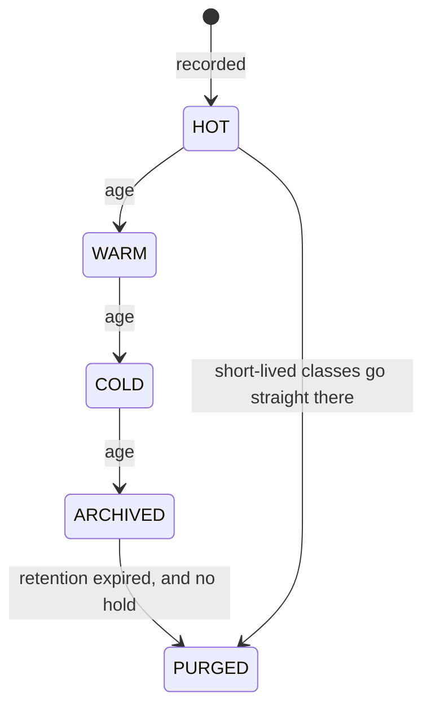

# SAG-F2 — Archival

> **Not built.** No audit row has ever been archived; the retention sweep
> deletes directly from the hot table. This is the design. Status 2026-09-16.

## Lifecycle states

These are **Koras logical states**. A provider may implement any of them
differently, or not at all, and the model exists so that the product does not
have to care.

| State | For an audit row | For a stored object |
|-------|------------------|---------------------|
| HOT | In `audit_events`, indexed, searchable | In its normal bucket |
| WARM | In the same table. Metadata only | Metadata only |
| COLD | In the same table, outside the working range | Metadata only |
| ARCHIVED | Written to the archive destination, removed from the hot table | Copied to the archive bucket |
| PURGED | Gone, irreversibly | Gone, irreversibly |

**WARM and COLD are metadata for both.** No provider this estate uses offers
storage tiering — Supabase Storage has none and R2 has no Glacier equivalent —
and Postgres does not move rows to cheaper storage on its own. Naming five
states and physically implementing two is honest; implying a provider does
something it does not is not.

That is ADR 0003 decision 11, taken 2026-09-15.

## Transitions and their triggers

| Transition | Trigger | Who performs it |
|------------|---------|-----------------|
| HOT → WARM → COLD | age against the class threshold | nothing yet; a marker with no physical effect |
| COLD → ARCHIVED | age against the archive threshold | the archive step, unbuilt |
| ARCHIVED → PURGED | retention expiry **and** no active hold | the retention sweep |
| HOT → PURGED | retention expiry for a class with no archive threshold | the retention sweep, today |

The last row is what actually happens on 2026-09-16: activity rows reach 90 days
and are deleted, with no intermediate state.

## Two rules that must not be reversed

**Write before you remove.** A row is written to the archive destination and
confirmed there *before* it leaves the hot table. An archive step that removes
first and writes second loses data on any failure between the two, and the
failure it loses data on is exactly the one that will happen — the destination
being unreachable.

**A hold outranks an expiry.** Purge is the only irreversible transition, and it
is the one a legal hold blocks. Until `legal-hold.md` is built, nothing checks,
which is why AUDIT-009 cannot be called finished despite the sweep working.

## Where archived rows would go

Open, and the same open question as storage archival: **nothing in Terraform
creates a bucket.** `STORAGE_BUCKET` is `supplied` for exactly that reason.

Two candidates:

| Option | For | Against |
|--------|-----|---------|
| A second bucket through the existing object store | Reuses the provider seam, the credentials and the key convention | An audit row is not a file; retrieval means reading a whole archive object to find one row |
| A separate Postgres table with no indexes | Queryable, no new infrastructure | Does not actually make anything cheaper, which was the point |

Neither is chosen. The decision should wait until a real retention requirement
exists, because the right answer depends on whether archived rows must be
searchable or merely producible.

## Retrieval

An archived row must be retrievable, or archiving is deletion with extra steps.
The intended shape reuses the export pipeline: an authorized request, a
background job, a signed artifact that expires — rather than restoring rows into
the hot table, which would make an archived row indistinguishable from a live
one.

## Volume, and whether this is needed at all

Worth stating plainly: **no product in this estate has an audit table large
enough to need archiving as of 2026-09-16.** The classes and their retentions
already bound growth, and activity — the bulk of the rows — expires at 90 days.

Archival becomes necessary when a regulatory requirement demands retention
longer than the hot table can carry comfortably. Building it before that is
building for a number nobody has given.
