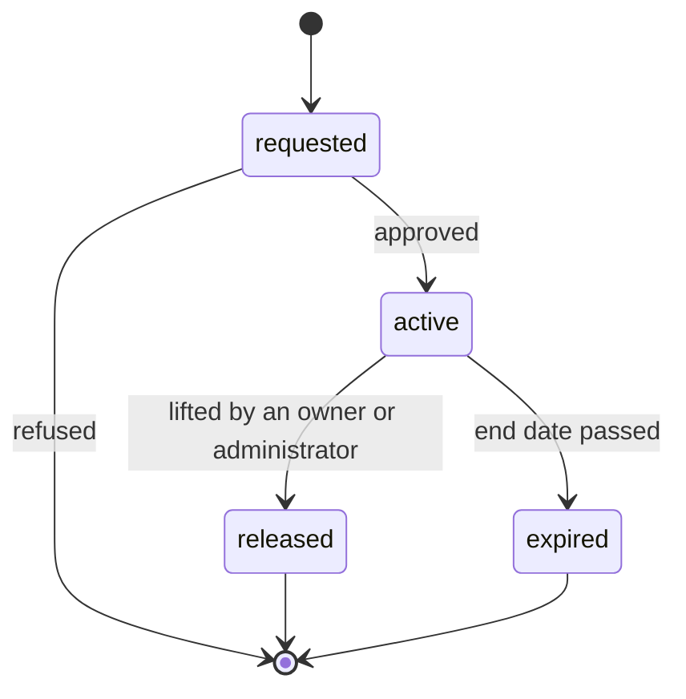
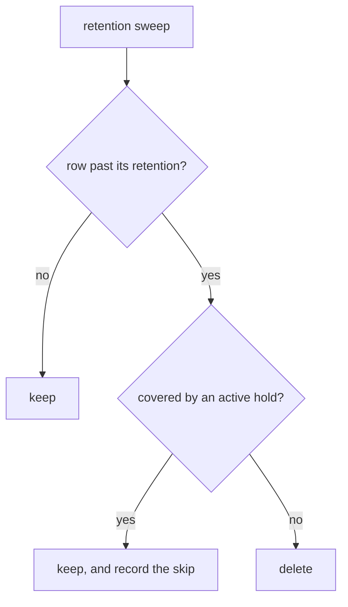

# SAG-F2 — Legal and compliance hold

> **Not built.** `files.legal_hold` exists as a column from
> `00018_files_governance.sql` and **nothing reads it**; there is no hold record
> for audit rows at all. This is the design. Status 2026-09-16.

## The rule everything else serves

> **A retention job must not delete a record under an active hold.**

Retention is a schedule. A hold is a reason to stop the schedule. If the
schedule wins, retention becomes an obstruction rather than a policy — records
an investigation needs disappear on time, which is the worst possible moment.

A hold therefore outranks everything, including a regulatory expiry: a record
under hold is kept past the date it would otherwise have gone, because the hold
exists precisely for the case where somebody needs it after it would normally
have been forgotten.

## The record

| Field | Purpose |
|-------|---------|
| hold id | Identity |
| scope | What it covers — a tenant, a set of objects, an audit range, an actor |
| reason | Free text for a person; never a case number this system validates |
| requested by | Who asked |
| approved by | Who authorized. **Not the same person by default** |
| start date | When it takes effect |
| end date | Optional. A hold with no end is normal |
| status | `requested`, `active`, `released`, `expired` |

## Lifecycle

## Authorization

| Action | Who |
|--------|-----|
| Request | Anyone with the proposed `audit.legal_hold` permission |
| Approve | Owner or administrator, **and not the requester** where the two differ |
| Lift | Owner or administrator |
| Read | Anyone who can see the scope it covers |

**Lifting is the dangerous operation, not placing.** Placing a hold keeps data;
the failure mode is cost. Lifting makes a purge possible again, and the failure
mode is destroyed evidence. So lifting carries the higher bar, and both are
audited as administrative events with who requested and who approved.

This is the same asymmetry the AI foundation applies to destructive tools, and
the approval machinery is reused rather than rebuilt.

## Effect on retention and purge

Two implementation notes that are easy to get wrong:

1. **The sweep's `WHERE` must exclude held rows**, and in Postgres a qualified
   delete needs a **select** policy as well as a delete policy — the lesson
   migration `00008_ai_retention.sql` records and 00009 and 00013 restate. A
   delete policy alone finds nothing.
2. **The skip is recorded.** A hold that silently keeps data looks identical to
   a sweep that failed. The count of rows skipped for a hold is the evidence
   that the hold is working.

## Effect on the object lifecycle

A hold blocks archival and purge for objects as well as audit rows: an object
under hold is not moved to the archive bucket and not removed. It may still be
downloaded — a hold preserves, it does not quarantine.

Deletion by a person is a separate question from the sweep's deletion, and a
hold should block that too. Otherwise the hold protects against the schedule and
not against the mistake, and the mistake is more likely.

## Tenant isolation

A hold on a row a tenant cannot see is not a hold.

The property the engine will depend on is already proven for objects:
`supabase/tests/170_files_governance_isolation.sql` asserts that a tenant cannot
lift another tenant's `legal_hold`, cannot shorten another tenant's
`retain_until`, and can do both to its own. That test was written on 2026-09-15,
before anything consulted either column, precisely so the boundary was
established before the behaviour.

A platform-wide hold placed by KORAS staff is a different thing and would run on
the provisioning context, which no customer can reach.

## Auditability

Every hold action generates an audit event, classified `administrative`:
requested, approved, refused, lifted, expired. Those rows are themselves subject
to retention — and to holds, which is not circular so long as a hold on audit
rows is scoped by time and actor rather than by "everything including the record
of this hold".

## What blocks building it

| # | Blocker |
|---|---------|
| 1 | No hold table exists, for objects or for audit rows |
| 2 | No `audit.legal_hold` permission in either mirrored catalogue |
| 3 | No entitlement code in the platform catalogue, and adding one is Control Plane work this task must not do |
| 4 | The retention sweeps do not check anything, so adding the record without changing them would give false assurance |

Blocker 4 is the one to watch. **A hold record that nothing enforces is worse
than no hold record**, because it looks like a control on a compliance
questionnaire and is not one. If this is built, the sweep changes in the same
commit.
