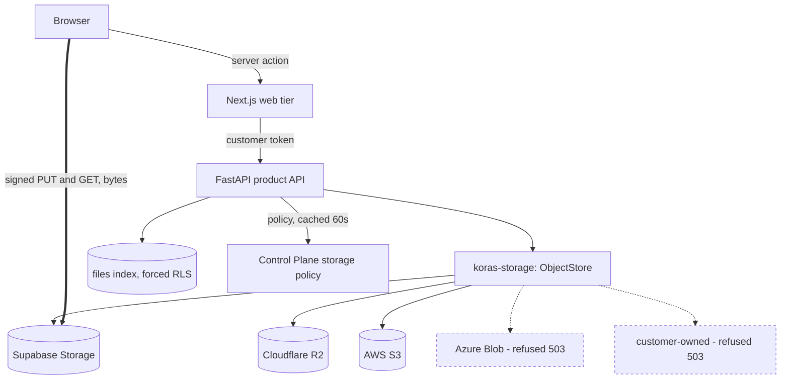
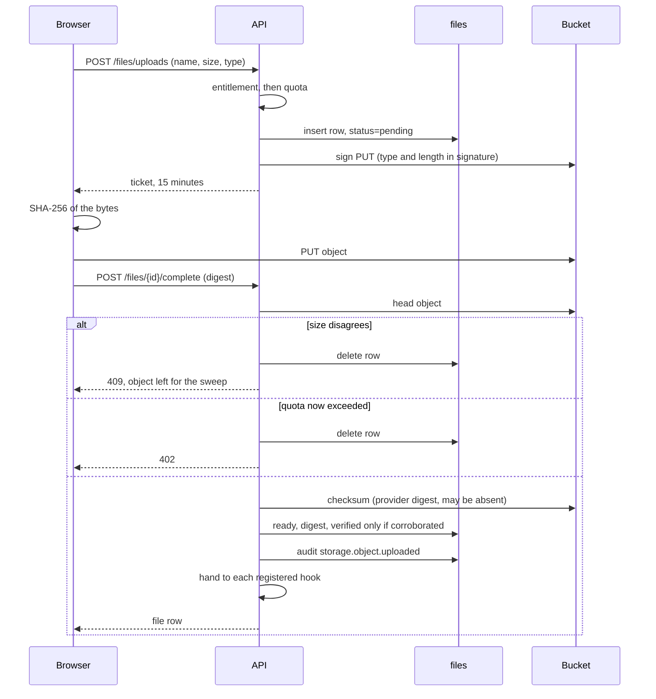
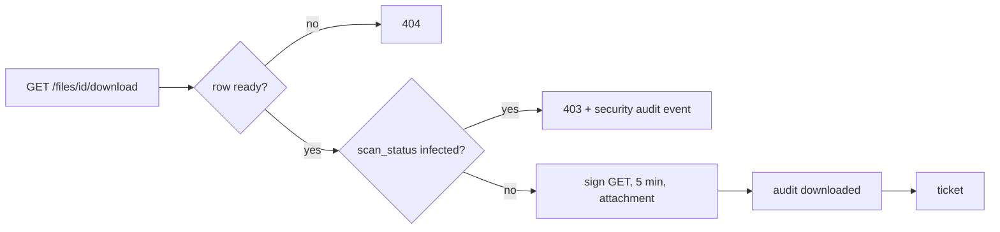
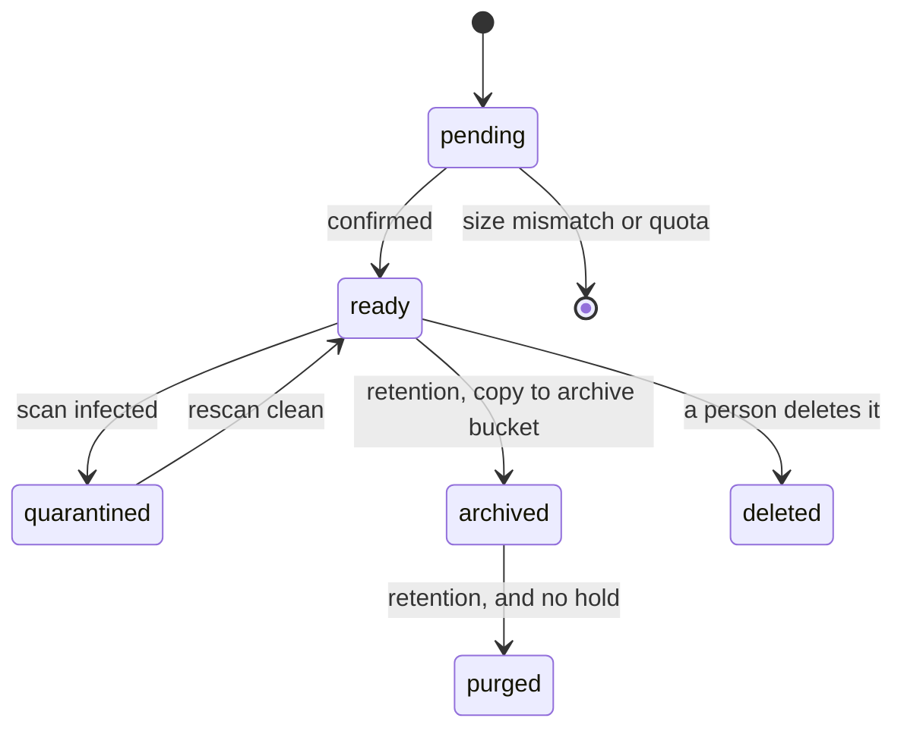
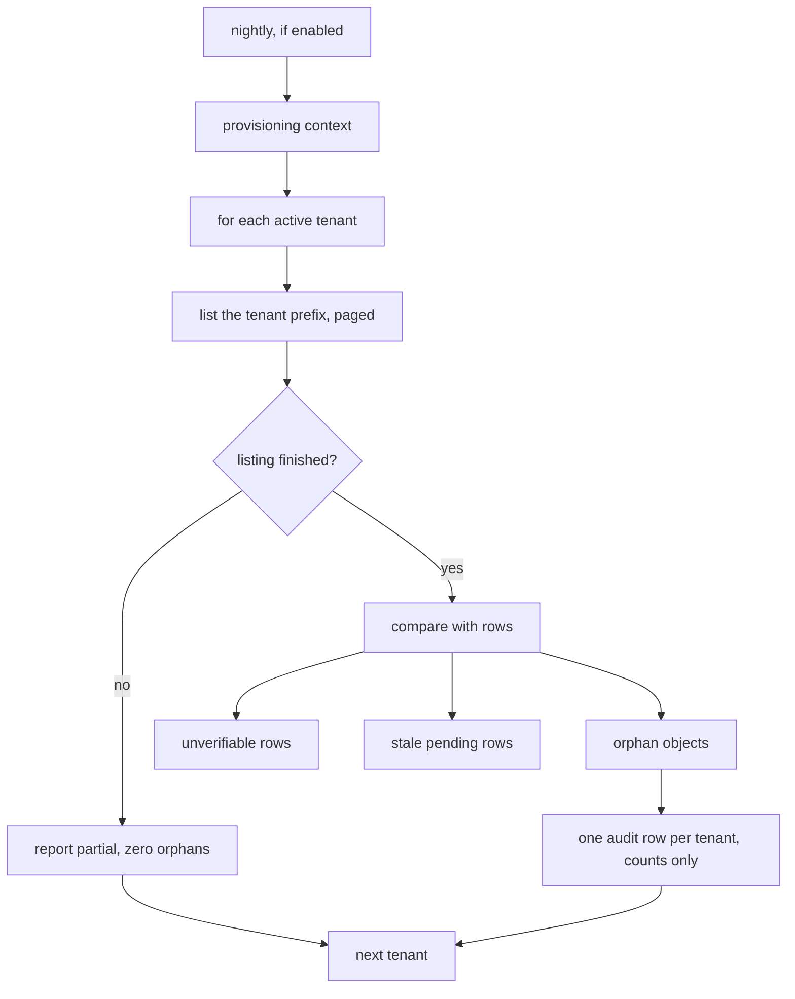

# SAG-F1 — Architecture

The prose description is `docs/STORAGE_ARCHITECTURE.md`. This document carries
the diagrams and the feature-scoped reasoning that does not belong in a
subsystem reference.

## Layering



The thick edge is the one that matters: **the bytes never traverse the product.**
Everything else is a control-plane decision about who may obtain a signature.

Only the three S3-compatible providers are implemented. The two dashed ones are
named by the Control Plane's enum and refused with a reason, because a policy
naming a provider the product cannot serve must not fall back to the default.

## Upload



Three things in that sequence are the feature rather than the plumbing:

1. **The digest is taken before the PUT**, so it describes the bytes this
   browser holds rather than a file that changed on disk mid-upload.
2. **The quota is checked twice.** Between the two checks another ticket may
   have been issued and confirmed.
3. **A size mismatch deletes the row and not the object.** Deleting on a
   client's word is how a race loses a file.

## Download



The scan check is **before** the signature. A control the page consults and the
API does not is a suggestion.

## The object key

```
tenants/<tenant>/<category>/<file>/<safe name>
```

| Segment | In the key? | Reasoning |
|---------|-------------|-----------|
| tenant | yes | The security boundary, and stable for the object's life |
| category | yes | Closed set. Was emergent and diverging before 2026-09-15 |
| environment | no | Already a separate project and bucket |
| organization | no | Mutable. A tenant that moves would need every object copied |
| product | no | A deployment is one product; a constant segment says nothing |
| date | no | Exists to make prefix listing cheap, and nothing lists by prefix |

Everything omitted is a column. See ADR 0005.

## Lifecycle — designed, not built



`ready → archived → purged` is the part nothing performs on 2026-09-16. HOT,
WARM and COLD are metadata; ARCHIVE is the only physical move, because no
provider in scope offers tiering.

## Reconciliation



`Zero` is the whole safety property. A truncated listing looks exactly like a
prefix with fewer objects in it.

## Boundaries

| Boundary | Enforced by |
|----------|-------------|
| Tenant | `tenant_id` + forced row-level security, plus the key prefix the API mints |
| Product | One deployment, one product, one bucket. Not a runtime check |
| Environment | A separate Supabase project per environment; separate endpoint and credentials |
| Organization | A column, resolved from the verified token. Never from the key |

## Encryption

At rest by the provider; in transit by TLS on every signed URL. The product
holds no encryption key of its own and does not encrypt object bodies before
upload. Customer-managed keys are not supported as of 2026-09-16 and would need
their own decision — the `customer-owned` provider is refused for the adjacent
reason that nothing in the estate holds such a credential.
